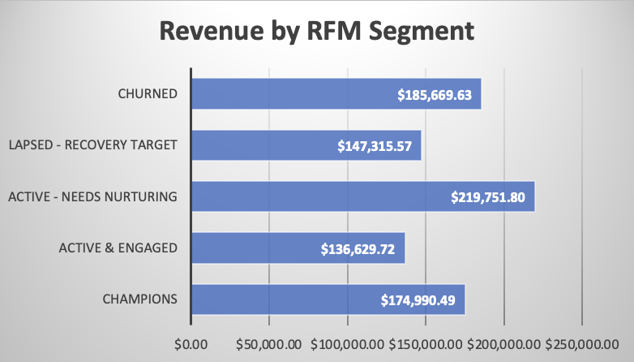
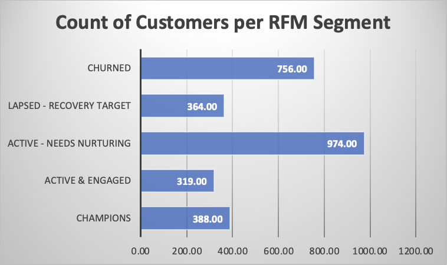

# Brazilian E-Commerce Customer Retention Analysis
**Olist Dataset | PostgreSQL | Advanced SQL**

>  Analyzed 93,357 customers and $15.4M in revenue to uncover a 97% one-time buyer crisis. Identified $864K retention opportunity through RFM segmentation and data-driven intervention strategies.

---
## 🎯 Executive Summary

### Critical Finding
**97% of customers never make a second purchase** - representing a severe retention crisis. Scenario analysis suggests that doubling the repeat rate from 3% to 6% could generate approximately $864K in additional revenue, assuming similar customer behavior.

### Key Metrics
| Metric | Value | Insight |
|--------|-------|---------|
| **Repeat Purchase Rate** | 3.00% | 97% never return |
| **One-Time Buyers** | 90,556 (97%) | Massive acquisition waste |
| **Repeat Customers** | 2,801 (3%) | Only 3% show loyalty |
| **Total Revenue** | $15.4M | 94% from one-timers |
| **Repeat Customer Value** | $308.59 | 91% higher than one-timers ($160.76) |
| **Typical repurchase cycle (median)** | 75 days | Natural repurchase window |
| **Churn Threshold** | 291 days | P90 - 90% of repeat purchases occur before this point, suggesting customers inactive beyond this window are highly unlikely to return. |

### The $864K Opportunity
Doubling the repeat rate from 3% to 6% could represent up to **$864K in additional revenue** assuming similar customer value and conversion rates with **zero customer acquisition cost**.

(Current repeat revenue: $864K from 2,801 repeat customers
Average repeat customer value: $308.59
If repeat rate doubled to 6%:
+2,801 additional repeat customers
2801 × $308.59 ≈ $864,357 additional revenue)

---

## 📊 Project Overview

This project performs a comprehensive customer retention analysis of a Brazilian e-commerce marketplace using advanced SQL techniques. The analysis reveals critical retention gaps and quantifies specific opportunities for revenue growth through targeted customer engagement.

**Dataset:** Olist Brazilian E-Commerce (2016-2018)  
**Scale:** 96,478 orders | 93,357 customers | $15.4M revenue  
**Database:** PostgreSQL  
**Author:** Eoghan Kealy

All analysis was performed using PostgreSQL with advanced SQL features including window functions (LAG, NTILE), statistical aggregates (PERCENTILE_CONT), and multi-stage CTE pipelines.


## 🧠 Skills Demonstrated

This project demonstrates the ability to translate raw transactional data into actionable business insights using SQL.

Key capabilities showcased:

- **Advanced SQL analytics**
  - Window functions (`LAG`, `ROW_NUMBER`, `NTILE`)
  - Statistical analysis using `PERCENTILE_CONT`
  - Multi-stage CTE pipelines

- **Data modelling & data quality**
  - Schema design and referential integrity checks
  - Data validation and anomaly detection
  - Handling privacy-preserving identifiers (`customer_id` vs `customer_unique_id`)

- **Customer analytics**
  - RFM segmentation
  - Customer lifecycle and churn analysis
  - Purchase interval modelling

- **Business insight generation**
  - Translating technical findings into strategic recommendations
  - Identifying $864K potential revenue opportunity
  - Designing retention strategies based on observed purchase behavior
---
## 📁 Project Structure

```
brazilian-ecommerce-sql-analysis/
│
├── 01_database_setup_schema.sql
│   └── Database schema creation and initial data structure
│
├── 02_data_quality_checks.sql
│   └── Data validation, integrity checks, and anomaly detection
│
├── 03_business_performance_analysis.sql
│   └── Revenue metrics, KPIs, and marketplace performance analysis
│
├── 04_rfm_analysis.sql
│   └── Customer segmentation using RFM methodology
│
├── 05_retention_root_cause_analysis.sql
│   └── Hypothesis testing for drivers of repeat purchases
│
├── 06_churn_and_repeat_purchase_analysis.sql
│   └── Purchase interval analysis and churn identification
│
└── README.md
    └── Project documentation and findings
```

---

## 🔍 Methodology & Technical Implementation

This project implements a structured SQL workflow across six analysis modules, transforming raw transactional data into actionable retention strategies.

---

### Phase 1: Database Setup & Data Quality
**Files:** `01_database_setup_schema.sql` | `02_data_quality_checks.sql`

**What I Built:**
- Two-schema ETL architecture (raw → cleaned) for data lineage
- 9 cleaned tables  with primary keys, composite primary keys and foreign key relationships
- Comprehensive validation: NULL checks, orphan detection, referential integrity
- Payment reconciliation analysis (249 discrepancies identified)

**Key Discovery:** 
The dataset uses two customer identifiers for privacy:
- `customer_id`: Unique per transaction (anonymization)
- `customer_unique_id`: Unique per person (repeat behavior tracking)

This design required all customer-level analysis to use `customer_unique_id`, not `customer_id`.

**Technical Decision:** Use `order_payments.payment_value` as revenue source of truth. Payment values were higher than `order_items.price + freight_value` in 249 orders (likely due to installment financing fees common in Brazilian e-commerce). This captures actual cash flow rather than base transaction value.

---
### Phase 2: Business Performance Analysis
**File:** `03_business_performance_analysis.sql`

**What I Analyzed:**
- Executive revenue summary: $15.4M across 96,478 orders
- Monthly trends using `LAG()` window functions for MoM growth
- Geographic concentration: 6 states (out of 27 total) generate 80% of revenue (Pareto analysis)
- Product category performance across 70+ categories

**1st Critical Finding: The Retention Crisis Discovery** 

97% one-time buyer rate discovered - the foundation for all subsequent retention analysis.


**2nd Critical Finding:** 
While revenue is concentrated in major hubs, the orders per customer remain stable (~1.03) across all regions. This proves that high-revenue states aren't more "loyal"—they simply have higher customer volume.

**Strategic Takeaway:** Revenue growth is currently driven by "New User Volume" in major hubs rather than customer loyalty. This suggests that expanding into new regions is secondary to fixing the **platform-wide retention gap.**


**SQL Techniques:** Window functions (LAG, running totals), CTEs, aggregation strategies to prevent row explosion.


---

### Phase 3: RFM Customer Segmentation
**File:** `04_rfm_analysis.sql`

**Dual Approach:**

**3a. Traditional RFM (All Customers)** - Demonstrated failure
- Applied NTILE(5) scoring to 93,357 customers
- Result: "Champions" (5-5-5) had avg value $39 vs "Worst" (1-1-1) at $324
- **Why it failed:** 97% one-time buyers (frequency = 1) created undifferentiated buckets
- **Lesson:** Statistical methods fail when data lacks variation

**3b. Hybrid RFM (Repeat Customers Only)** - Actionable solution
- Focus on 2,801 repeat customers (3%) where behavioral variation exists
- Combined NTILE scoring with business-rule overrides: `frequency >= 5` → Champion
- Created 5 actionable segments with revenue attribution

**Result:** 974 "Needs Nurturing" customers identified as highest-leverage opportunity ($44K potential).



*Figure 1: RFM revenue analysis on 3% who actually made 2 or more purchases*




*Figure 2: RFM customer count by segment of 3% who actually made 2 or more purchases*


**SQL Techniques:** Multi-level CTEs (5-7 deep), NTILE window functions, CASE logic for hybrid segmentation.

---

### Phase 4: Retention Root Cause Analysis
**File:** `05_retention_root_cause_analysis.sql`

**Hypothesis-Driven Testing:**

**H1: Experience Quality** ❌ Rejected
- Compared review scores: 4.21 (repeat) vs 4.15 (one-time)
- Difference: 0.06 points (1.4%) - negligible
- **Conclusion:** Both groups equally satisfied

**H2: Product Category** ❌ Rejected
- Top 5 categories: 4 of 5 identical across groups
- Statistical analysis: Only 2 categories significantly above baseline (home_appliances: 8.61%)
- **Conclusion:** Category doesn't drive repeat behavior

**H3: Structural Marketing Gap** ✅ Probable Root Cause Identified
- High satisfaction (4.15★) but zero return behavior
- **Conclusion:** Operations excel, retention infrastructure missing/ineffective

**SQL Techniques:** Aggregation across customer segments, statistical comparisons, join-based hypothesis testing.

---

### Phase 5: Churn & Purchase Cycle Analysis
**File:** `06_churn_and_repeat_purchase_analysis.sql`

**What I Calculated:**
- Time-between-purchases using `LAG()` window function
- Filtered 829 same-day purchases (30% of "repeats") to isolate true repurchase behavior
- Statistical distribution: P25=23 days, P50=75 days, P75=177 days, P90=291 days
- Customer status segmentation: Active (6.1%), At Risk (15.3%), Churned (78.5%)

**Key Finding:** 75-day median purchase cycle → basis for Day 30/60/90 intervention timing.

**Churn Threshold:** 291 days (P90) - beyond this point, 90% never return.


*Figure 3:  Analysis on how many days between first and second purchase*

**SQL Techniques:** Window functions (LAG, ROW_NUMBER), PERCENTILE_CONT for distribution analysis, date arithmetic.

---

## 📈 Key Findings

### Finding 1: Severe Retention Crisis
**The Numbers:**
- 90,556 customers (97%) bought once and never returned
- Only 2,801 customers (3%) made 2+ purchases
- 228 customers (0.24%) made 3+ purchases
- 47 customers (0.05%) made 4+ purchases

## Repeat Purchase Behaviour

Analysis of customer order history shows that most customers purchase only once. 
To help understand the scale of the retention problem, here is a  purchase progression funnel.

### Customer Purchase Funnel

```text
Customer Purchase Funnel

           93,357 Customers
           (≥1 purchase)
        ───────────────────
                │
                ▼
        2,801 Customers
        (≥2 purchases)
        Retention: 3.0%
        ───────────────────
                │
                ▼
          228 Customers
          (≥3 purchases)
          Retention: 0.24%
        ───────────────────
                │
                ▼
           47 Customers
          (≥4 purchases)
          Retention: 0.05%
```


**Customer Journey Drop-off:**
```
1st → 2nd purchase: 97.0% drop-off (90,556 lost)
2nd → 3rd purchase: 91.9% drop-off (2,801 → 228)
3rd → 4th purchase: 74.0% drop-off (181 → 47)
```

**Implication:** Breaking the first barrier (1st → 2nd purchase) is the critical challenge.

---

### Finding 2: Traditional RFM Fails Spectacularly

**The Paradox:**
| Segment | Customers | Avg Frequency | Avg Value | Expected | Reality |
|---------|-----------|---------------|-----------|----------|---------|
| 5-5-5 "Champions" | 3,697 | **1.00** | **$39.44** | Best customers | Recent one-timers |
| 1-1-1 "Worst" | 3,161 | 1.07 | **$324.36** | Worst customers | Higher value! |

**Why It Failed:**
- NTILE(5) divides 93,357 customers into 5 equal buckets (~18,671 each)
- With 90,556 having frequency = 1, all buckets dominated by one-timers
This revealed a key analytical limitation:
- When 97% of customers have frequency = 1, statistical
segmentation methods like NTILE cannot create meaningful
behavioral segments.
- No behavioral variation to segment on
- Statistical bucketing != business reality

**The Fix:** Pivot to repeat-customer-only RFM where variation exists.

---

### Finding 3: Hybrid RFM Creates Actionable Segments

**Repeat Customer Segmentation (2,801 customers, $864K revenue):**

| Segment | Count | % | Avg Value | Avg Recency | Total Revenue | Strategy |
|---------|-------|---|-----------|-------------|---------------|----------|
| **Champions** | 388 | 13.8% | $451 | 131 days | $175K (20%) | VIP retention |
| **Active & Engaged** | 319 | 11.4% | $428 | 134 days | $137K (16%) | Maintain momentum |
| **Active - Needs Nurturing** | 974 | 34.8% | $226 | 199 days | $220K (25%) | **Highest leverage** |
| **Lapsed - Recovery Target** | 364 | 13.0% | $405 | 341 days | $147K (17%) | Win-back campaign |
| **Churned** | 756 | 27.0% | $246 | 452 days | $186K (22%) | Minimal investment |

**Critical Insight:** The inverted pyramid problem
- 62% of repeat base is weak (Needs Nurturing 35%) or lost (Churned 27%)
- Only 25% are truly engaged (Champions + Active & Engaged)
- 974 "Needs Nurturing" customers represent the highest-leverage intervention point

---

### Finding 4: Purchase Cycle Timing

**Same-Day Purchases:**
- 829 out of 2,801 repeat purchases (30%) occurred same day
- Represents multi-item shopping sessions, not true repeat behavior
- Filtered out to isolate genuine repurchase patterns

**Excluding Same-Day Purchases (1,972 customers):**
| Metric | Value | Interpretation |
|--------|-------|----------------|
| **Median** | 75 days | Typical repeat purchase window |
| **P25** | 23 days | 25% return within ~3 weeks |
| **P75** | 177 days | 75% return within ~6 months |
| **P90** | 291 days | **Churn threshold** - 90% return by this point |
| **Average** | 115 days | Mean pulled up by late returners |

**Purchase Window Distribution:**
```
31-90 days:   492 customers (25%) ← Natural purchase cycle
180+ days:    480 customers (24%) ← At risk of churn
91-180 days:  413 customers (21%)
8-30 days:    388 customers (20%)
0-7 days:     199 customers (10%)
```

---

### Finding 5: Root Cause - Structural, Not Operational

**Hypothesis Testing:**

**H1: Experience Quality** ❌ **REJECTED**
```
Repeat Customers:  Avg 4.21★, 62.2% five-star, 99.1% review rate
One-Time Buyers:   Avg 4.15★, 59.0% five-star, 99.3% review rate
Difference:        0.06 points (1.4%) - NEGLIGIBLE
```
**Conclusion:** Both groups are equally satisfied. Quality isn't the differentiator.

**H2: Product Category** ❌ **MOSTLY REJECTED**
- 4 of top 5 categories identical for both groups
- Only home_appliances (8.61% repeat rate) and fashion_bags_accessories (5.79%) significantly above baseline (3%)
- These represent only 2.5% of customer base
- Category alone doesn't explain 97% one-time rate

**H3: Structural Marketing Gap** ✅ **Most Likely Root Cause Identified**

**Evidence:**
- High satisfaction (4.15+ stars) but no behavioral loyalty
- 97% never return despite satisfaction
- No observable repeat-purchase incentives
- Transactional completion without relationship building
- Customers show no platform recall (inferred from behavior)

**Conclusion:** Olist operates as a **transactional marketplace** (like eBay) - completes transactions well but shows no evidence of retention infrastructure driving repeat behavior. Whether mechanisms are absent, ineffective, or poorly executed, the outcome is identical: a **MARKETING problem, not an OPERATIONS problem**.

---

## 💡 The Core Paradox

### Satisfied Customers ≠ Loyal Customers

**Olist proves you can deliver excellent experiences and still struggle with retention when the business model lacks repeat purchase mechanisms.**
| ✅ What's Working (Observable) | ⚠️ What The Data Reveals Is Missing/Ineffective |
|-------------------------------|--------------------------------------------------|
| High customer satisfaction (4.15+ stars) | No observable behavioral incentive to return |
| Broad product selection across all categories | Limited consumable/replenishment products driving natural repeat need |
| Reliable delivery and service | No evidence of effective retention mechanisms |
| Strong operational execution | Insufficient post-purchase engagement (inferred from behavior) |
| 99%+ review participation rate | Transactional completion focus vs. relationship building |

**The Gap:** Operations excel at completing transactions. The 97% one-time buyer rate indicates either absent or ineffective retention infrastructure.

**Data-Based Inference:**
When 97% of satisfied customers (4.15★ average) never return despite a clear 75-day purchase cycle existing in the 3% who DO return, the data points to one of three scenarios:

1. **Retention mechanisms don't exist** (no loyalty program, no post-purchase emails)
2. **Retention mechanisms exist but are ineffective** (wrong timing, poor targeting, weak incentives)
3. **Retention mechanisms exist but are poorly executed** (emails going to spam, offers misaligned with customer needs)

Without access to Olist's internal marketing systems, the transactional data alone cannot distinguish between these scenarios. However, the *outcome* is identical across all three: **$864K in unrealized repeat revenue**.

**What we can definitively state from the data:**
- ✅ Customers are satisfied with individual transactions (4.15★ average)
- ✅ Customers show no behavioral pattern suggesting platform loyalty
- ✅ The 3% who do return follow a predictable 75-day median cycle
- ✅ 97% who don't return are not unsatisfied—they simply don't come back
- ✅ This pattern is consistent across all product categories and customer segments

**Strategic Implication:** 

Regardless of *why* retention infrastructure is failing (absent vs. ineffective vs. poorly executed), the data provides a clear prescription for *what* needs to happen: implement or optimize post-purchase engagement at critical touchpoints (Day 30, 60, 90) based on the observed 75-day natural purchase cycle.

The business problem is solvable with or without knowing the current state of internal systems—the behavioral data tells us exactly when and how to intervene.


---

### Finding 6: Customer Status Distribution

**Current State (as of dataset end date):**
| Status | Customers | % of Base | Definition |
|--------|-----------|-----------|------------|
| **Likely Churned** | 73,333 | 78.5% | Inactive 150+ days (2+ purchase cycles) |
| **At Risk** | 14,309 | 15.3% | Inactive 75-150 days (1-2 cycles) |
| **Active** | 5,716 | 6.1% | Purchased within last 75 days |

**Implication:** The vast majority (78.5%) have already churned by the end of the dataset period.

---

## 💡 Strategic Opportunities

The analysis reveals several clear opportunities to improve customer retention based on observed purchase cycles and behavioral segmentation.

1. **Activate first-time buyers within the 75-day repurchase window**  
   The median repeat purchase cycle is **75 days**, suggesting that post-purchase engagement during the first **30–75 days** is the most critical window to convert one-time buyers into repeat customers.

2. **Re-engage “Needs Nurturing” repeat customers (974 users)**  
   This segment represents the largest portion of the repeat customer base but shows declining recency. Targeted re-engagement campaigns timed around the **60–90 day window** could reactivate a meaningful share of these customers.

3. **Protect high-value Champions**  
   Although small in number, Champions generate a disproportionate share of repeat revenue. Loyalty incentives and early product access could help maintain engagement and prevent churn.

4. **Run win-back campaigns for recently lapsed customers**  
   Customers who previously demonstrated repeat behavior but have become inactive represent a valuable recovery opportunity. Interventions around the **90–180 day inactivity window** may help recover a portion of these customers before they fully churn.
---

## 🛠️ Technical Highlights

### Advanced SQL Techniques Used
- **Window Functions:** `LAG()`, `ROW_NUMBER()`, `NTILE()`, running totals
- **CTEs:** Multi-level common table expressions for complex logic
- **Statistical Functions:** `PERCENTILE_CONT()`, percentile calculations
- **Composite Primary Keys:** Many-to-many relationship modeling
- **Aggregation Strategies:** Pre-aggregation to prevent row explosion
- **Data Validation:** Orphan detection, referential integrity checks

### Key Technical Decisions

**1. Revenue Source Selection**
- Used `order_payments.payment_value` instead of `order_items.price + freight_value`
- Reason: Captures actual cash received including installment fees
- Validation: Identified 249 orders with discrepancies due to Brazilian installment financing

**2. Customer Identifier Choice**
- Used `customer_unique_id` instead of `customer_id`
- Reason: Privacy-preserving design means each order gets new `customer_id`
- Impact: Critical for accurate repeat purchase analysis

**3. NULLIF Strategy**
- Applied only to nullable columns in schema
- NOT applied to required fields (fail-fast approach)
- Prevents empty strings from causing type-casting errors

**4. Same-Day Purchase Handling**
- 829 same-day repeat purchases identified (30% of repeats)
- Filtered out to isolate genuine repurchase behavior
- Prevents multi-item sessions from inflating repeat metrics

---


## 🎓 Key Learnings

### 1. When Standard Methods Fail, Adapt
Traditional RFM scored recent one-timers as "Champions" while churned loyalists were "Worst Customers." Recognizing this paradox led to the hybrid approach that actually worked.

### 2. The 97% Problem
When 97% of your data looks identical (frequency = 1), statistical bucketing (NTILE) cannot create meaningful segments. Focus on the 3% with variation.

### 3. Data Quality Detective Work
The `customer_id` vs `customer_unique_id` discovery required careful investigation. Initial metrics showed 1:1 order-to-customer ratio, which seemed wrong. Deep-diving into the data model revealed the privacy-preserving design.

### 4. Same-Day Purchases Are Not Repeat Purchases
30% of "repeat purchases" happened same-day. These are multi-item shopping sessions, not evidence of loyalty. Filtering them out revealed the true 75-day purchase cycle.

### 5. High Satisfaction ≠ Retention
Both repeat and one-time customers rated 4.15+ stars. The problem isn't operations - it's that satisfied customers have no reason to return to the platform versus shopping anywhere else.

---

## 🔮 Next Steps

### Immediate Actions (0-30 days)
1. Implement welcome email series for new buyers
2. Launch nurturing campaign for 974 at-risk customers
3. Deploy win-back campaign for 364 lapsed customers
4. Set up automated triggers based on 75-day cycle

### Short-Term (1-3 months)
1. A/B test discount levels (10% vs 15% vs 20%)
2. Measure baseline conversion rates
3. Track Champions retention rate
4. Monitor repeat rate movement (target: 3% → 4.5%)

### Medium-Term (3-6 months)
1. Implement loyalty program for Champions
2. Develop category-specific retention strategies
3. Test personalized product recommendations
4. Build predictive churn model

### Long-Term (6-12 months)
1. Platform experience improvements
2. Seller relationship programs
3. Subscription/membership offerings
4. Target: 3% → 6% repeat rate (+$864K)

---

## 💼 Business Value

This analysis provides:

1. **Quantified Opportunity:** $939K total revenue upside identified
2. **Prioritized Action Plan:** Clear ROI-ranked initiatives
3. **Data-Driven Timing:** 75-day purchase cycle, 291-day churn threshold
4. **Segment-Specific Strategies:** Tailored approach for each customer type
5. **Root Cause Clarity:** Structural marketing gap, not operations
6. **Baseline Metrics:** 3% repeat rate, $308.59 repeat customer value

---

## 📧 Contact

**Author:** Eoghan Kealy  
**Project Type:** SQL Portfolio | Customer Analytics | Retention Strategy  
**Tools:** PostgreSQL, Advanced SQL, RFM Segmentation  

---

## 📝 Acknowledgments

Dataset: [Olist Brazilian E-Commerce Public Dataset](https://www.kaggle.com/datasets/olistbr/brazilian-ecommerce) by Olist  


---

*This project illustrates how I use SQL not just for querying data, but for diagnosing business performance, quantifying opportunities, and driving strategy. I’m passionate about bringing this kind of analysis to a data-driven team.*


## 🔄 Project Iteration: Addressing Peer Feedback
Following the initial publication of this project on LinkedIn, a peer suggested a deep dive into whether specific product categories (e.g., durables vs. consumables) were the primary drivers of the 97% churn rate.

Action taken: I performed a secondary SQL analysis to isolate category-specific repeat rates.
Result: The data (visualized in the scatter plot above) debunked the initial hypothesis. Even "replenishable" goods like Health & Beauty (4.0%) underperformed "durables" like Furniture (7.2%), proving that the retention gap is a cross-category systemic failure.Reults of query are in available in Excel file.


*Figure 4:  Analysis of Product Category 
Volume vs. Retention Rate*